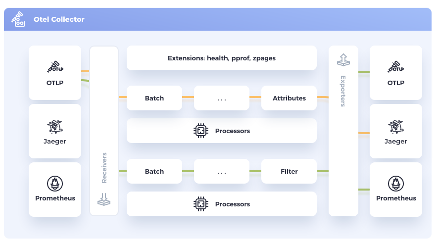

# Sampling

This tutorial step covers the basic usage of the OpenTelemetry Collector on Kubernetes and how to reduce costs using sampling techniques.

## OpenTelemetry Collector in a Nutshell

Structure of the OpenTelemetry Collector.



The OpenTelemetry Collector can be devided into a few major components.

- **Receivers**: Collect data from a specific source, like an application or infrastructure, and convert it into [pData (pipeline data)](https://pkg.go.dev/go.opentelemetry.io/collector/consumer/pdata#section-documentation). This component can be active (e.g. Prometheus) or passive (OTLP).
- **Processors**: Manipulates the data collected by receivers in some way. For example, a processor might filter out irrelevant data, or add metadata to help with analysis. Like the batch or metric renaming processor.
- **Exporters**: Send data to an external system for storage or analysis. Examples are Prometheus, Loki or the OTLP exporter.
- **Extensions**: Add additional functionality to OpenTelemetry, like configuring a bearer token or offering a Jaeger remote sampling endpoint.
- **Connectors**: Is both an exporter and receiver. It consumes data as an exporter in one pipeline and emits data as a receiver in another pipeline.

For more details, check the [offical documentation](https://opentelemetry.io/docs/collector/).

### OpenTelemetry Collector on k8s

After installing the OpenTelemetry Operator, the `v1alpha1.OpenTelemetryCollector` simplifies the operation of the OpenTelemetry Collector on Kubernetes. There are different deployment modes available, breaking config changes are migrated automatically, provides integration with Prometheus (including operating on Prometheus Operator CRs) and simplifies sidecar injection.

TODO: update collector
```yaml

```

## Sampling, what does it mean and why is it important?

Sampling refers to the practice of selectively capturing and recording traces of requests flowing through a distributed system, rather than capturing every single request. It is crucial in distributed tracing systems because modern distributed applications often generate a massive volume of requests and transactions, which can overwhelm the tracing infrastructure or lead to excessive storage costs if every request is
traced in detail.

For example, a medium sized setup producing ~1M traces per minute can result in a cost of approximately $250,000 per month. (Note that this depends on your infrastructure costs, the SaaS provider you choose, the amount of metadata, etc.)

To get a better feel for the cost, you may want to play with some SaaS cost calculators.

- TODO
- TODO
- TODO

### How can we now reduce the number of traces?


### Comparing Sampling Approaches

#### Head based sampling

TODO: Update SDK config
```yaml

```

<details>
  <summary>Jaeger's Remote Sampling extension</summary>
 
TODO:
https://github.com/open-telemetry/opentelemetry-collector-contrib/blob/main/extension/jaegerremotesampling/README.md
 
</details>

### Tailbased Sampling

TODO

---

[Next steps](./06-RED-metrics.md)


